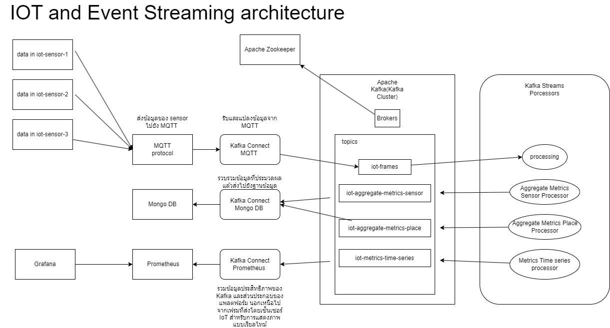

# Main technologies of architecture

## Architecture Overview

## Eclipse Mosquitto
เป็นซอฟต์แวร์ Open Source (EPL/EDL licensed) ที่ใช้สำหรับทำเป็น Broker 
ในระบบ MQTT Protocal ซึ่งติดตั้งและใช้งานได้ง่าย มีขนาดเล็กและเหมาะสำหรับ 
ใช้กับอุปกรณ์ทุกชนิด ตั้งแต่คอมพิวเตอร์ single board พลังงานต่ำไปจนถึงเซิร์ฟเวอร์
เต็มรูปแบบทำหน้าที่เป็นศูนย์กลางในการรับ-ส่งข้อมูลระหว่างอุปกรณ์ผ่านโปรโตคอล MQTT 
อย่างเช่นส่งข้อมูลเซ็นเซอร์โดยผ่าน MQTT protocol ไปแสดงผลยัง dashboard
โดยที่ MQTT เป็นโปรโตคอลสำหรับการส่งข้อมูลขนาดเล็กผ่านอินเตอร์เน็ตเหมาะสำหรับงาน 
IOT เนื่องจากกินพลังงานต่ำ 

## Apache ZooKeeper
เป็นส่วนของการบริการรวมศูนย์แบบ Open Source ที่รวมบริการต่างๆสำหรับการจัดการข้อมูล
และการกำหนดค่าต่างๆทำหน้าที่จัดการข้อมูลการกำหนดค่าต่าง ๆ และจัดการการประสานงานระหว่างเซอร์วิส

## Apache Kafka
แพลตฟอร์มสำหรับสตรีมมื่ง เป็นการประมวลผล รับ กระจาย และ ส่งข้อมูลแบบเรียลไทม์ ทำหน้าที่เป็นระบบส่งข้อความที่ช่วยในการแลกเปลี่ยนข้อมูลระหว่างเซอร์วิสในระบบ ช่วยให้การประมวลผลข้อมูลเป็นไปอย่างมีประสิทธิภาพ

## Apache Kafka Connect
ส่วนนี้สำหรับตีกรอบงานสำหรับเชื่อมต่อ kafka และการถ่ายโอนข้อมูลระหว่าง Kafka และระบบข้อมูลภายนอก เช่น MongoDB
ช่วยให้กำหนดตัวเชื่อมต่อที่ย้ายชุดข้อมูลขนาดใหญ่เข้าและออกจาก Kafka ได้อย่างรวดเร็วและง่ายดาย

## Apache Kafka Streams
Libary สำหรับการสร้าง app และ microservice และ ประมวลผลข้อมูลแบบสตรีมมิง (streaming data) ที่ได้รับจาก Kafka
ซึ่ง inputและoutput ถูกเก็บใน cluster apache kafka

## Prometheus
ใช้สำหรับดูmonitoringและตรวจสอบการทำงาน
บันทึกเมตริกแบบเรียลไทม์ภายในdatabase ใช้สำหรับแจ้งเตือนและตรวจสอบ
เมตริก (metrics) หมายถึง ข้อมูลที่ใช้ในการวัดและประเมินประสิทธิภาพหรือสถานะของระบบต่าง ๆ

## MongoDB
เป็นระบบฐานข้อมูลสำหรับบันทึกและจัดเก็บข้อมูลที่มาจากSensorและใช้งานกับ service อื่นๆ เช่น kafka connect เพื่อดึงหรือส่งข้อมูลระหว่าง Kafka และ MongoDB
จัดเก็บข้อมูลที่ไม่เป็นโครงสร้างหรือกึ่งโครงสร้าง (เช่น JSON documents) 

## Grafana
เป็นซอฟต์แวร์ Open Sourceสร้าง dashboard และแสดงผลลัพธ์ข้อมูล สามารถแสดงเป็นกราฟ สามารถดึงข้อมูลมาจาก datasource

