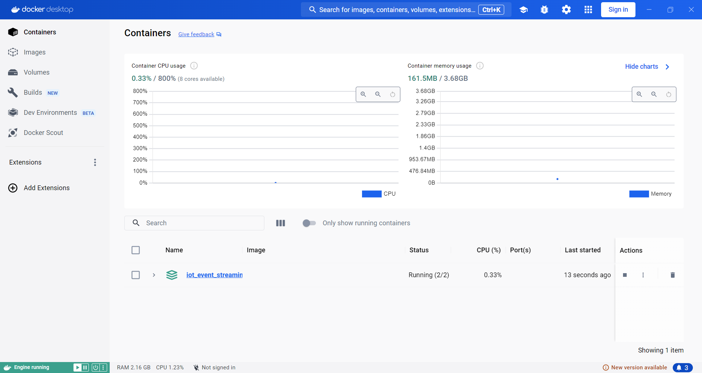

# MQTT
(Message Queuing Telemetry Transport)
เป็นส่วนที่สื่อสารและส่งข้อมูลระหว่างอุปกรณ์ IoT และ service ต่างๆภายในการทำงาน ใช้การสื่อสารแบบ Publisher-Subscriber
ในที่นี้ MQTT อยู่ในกระบวนการที่ส่งข้อมูลไยังkafka connect และ kafka connect ก็จะรับข้อมูลเพื่อประมวลผลและส่งออกไปยังservice อื่นๆ 


- update
ตอนนี้ได้เปลี่ยนส่วนของ MQTT เป็น gateway หรือ ตัวกลาง สำหรับรับทุกข้อมูล sensor ทุกกลุ่ม ให้ gateway รับค่าข้อมูล sensor ทั่วทุกกลุ่มที่มีการตั่งค่า IP mqtt ของ kafka connect


- เมื่อได้ข้อมูล sensor จาก mqtt ก็จะส่งข้อมูลไปยัง kafka-connect เพื่อเริ่มการ Ingest and store real-time data และ visualization ใน dashboard ของ grafana

## iot-sensor-1
- เป็น sensor จำลอง ที่ดึงมาจาก image เพื่อเป็นตัวเริ่มในการส่งข้อมูลไปยัง iot-processor และเริ่มกระบวนการถัดๆไป โดย iot-sensor-1 จะอยู่ภายใน docker-compose ของ server เป็น container
```
 # # IoT Sensor 1
  iot_sensor_1:
    image: ssanchez11/iot_sensor:0.0.1-SNAPSHOT
    container_name: iot_sensor_1
    restart: unless-stopped
    environment:
      - sensor.id=${IOT_SENSOR_1_ID}
      - sensor.name=${IOT_SENSOR_1_NAME}
      - sensor.place.id=${IOT_SENSOR_1_PLACE_ID}
    depends_on:
      iot-processor:
        condition: service_started
        restart: true
```
- เมื่อ รัน Script iot-sensor-1 ในส่วนของ iot-processor ก็จะรับข้อมูลไปประมวลผลและในส่วน kafka-connect
ก็จะได้ข้อมูลจาก protocol MQTT mosquitto และส่งข้อมูลโดย kafka-connect และนำข้อมูลจาก iot-sensor-1 ไป Visualization กับ grafana

## iot-sensor-2
คือการจำลองข้อมูลของเซ็นเซอร์ซึ่งที่อยู่ในคอมพิวเตอร์ทำงานภายใน Docker โดยข้อมูลนี้เป็นค่าที่ได้จากการ generateขึ้น จากนั้นส่งข้อมูลผ่าน Protocal MQTT ไปยัง Server เพื่อให้ประมวลผลกับแสดงผล

(ภาพตอนรันโปรแกรม)
.png)

.png)




## Spring Boot
คือ Framework ใน Spring อันหนึ่ง สามารถช่วยทำให้สร้าง Web application หรือ Web serviceได้ง่ายขึ้น เพราะ Spring Boot มี Auto Configuration ซึ่งช่วยลดความยุ่งยากในการกำหนดค่าต่างๆ และสามารถใช้งานได้ทันที เนื่องจาก Spring Boot มี Java Web Server ที่ built-in มาให้แล้ว ก็คือ Tomcat ทำให้ง่ายต่อการใช้งาน โดยมี Port default คือ 8080 ซึ่งสามารถแก้ไขเปลี่ยน Port ได้ที่ไฟล์ application.properties

## Apache Maven
เป็นเครื่องมือตัวนึงที่ช่วยให้นักพัฒนา (Developer) เขียน Java Application ได้ง่ายขึ้น เป็น Project Management Tools ที่คอยอำนวยความสะดวกสบายในการสร้าง Java Project 
Spring Boot และ Maven ใช้เพื่อ Compile Java ของ iot_senser_2 ใน PC เพื่อให้ sensor ทำงานภายในเครื่อง แล้วส่งข้อมูลไปยัง MQTT 

คำสั่ง Maven
docker run -it --rm --name my-maven-project -v "${PWD}":/usr/src/mymaven -w /usr/src/mymaven maven:3.8-openjdk-8 mvn clean install
docker run -it --rm --name my-maven-project -v .:/usr/src/mymaven -w /usr/src/mymaven maven:3.8-openjdk-8 mvn clean install


## iot-sensor-3-10
- เป็นของมูลจาก sensor, BMP 280, SHT4x จาก board cucumber และ KY-018 ที่ต่อจากขาแยกของ cucumber ESP32 ทั้ง7ตัว
 