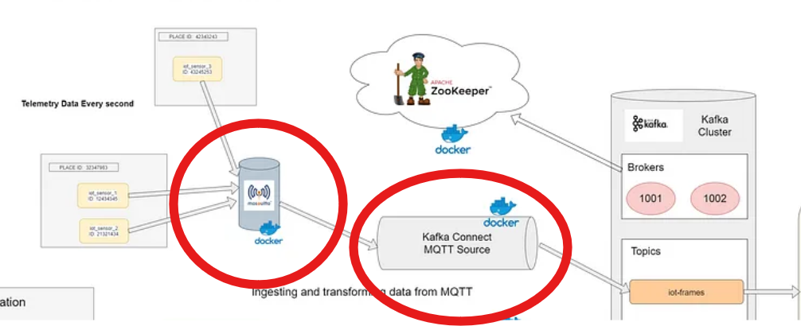
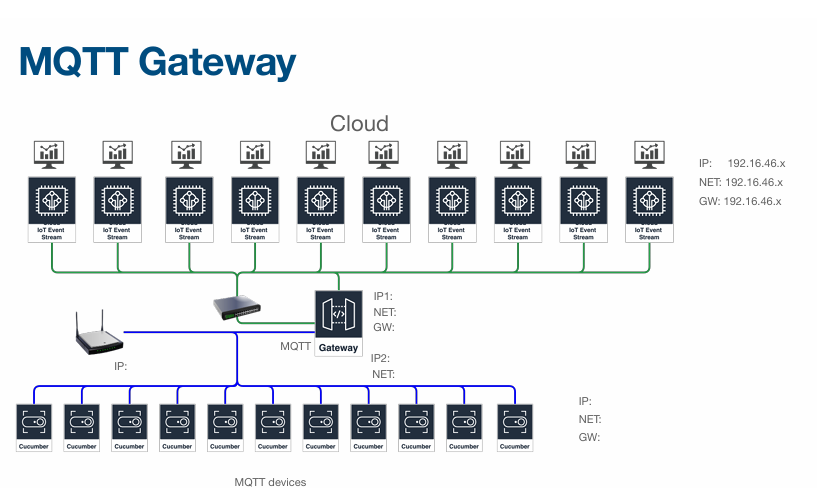
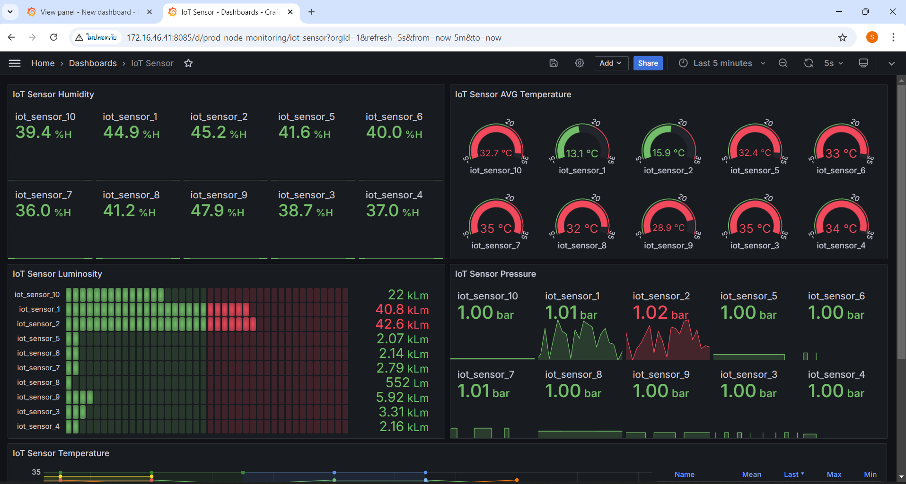

# MQTT
(Message Queuing Telemetry Transport)
เป็นส่วนที่สื่อสารและส่งข้อมูลระหว่างอุปกรณ์ IoT และ service ต่างๆภายในการทำงาน ใช้การสื่อสารแบบ Publisher-Subscriber
ในที่นี้ MQTT อยู่ในกระบวนการที่ส่งข้อมูลไยังkafka connect และ kafka connect ก็จะรับข้อมูลเพื่อประมวลผลและส่งออกไปยังservice อื่นๆ 



- update
ตอนนี้ได้เปลี่ยนส่วนของ MQTT เป็น gateway หรือ ตัวกลาง สำหรับรับทุกข้อมูล sensor ทุกกลุ่ม ให้ gateway รับค่าข้อมูล sensor ทั่วทุกกลุ่มที่มีการตั่งค่า IP mqtt ของ kafka connect



- เมื่อได้ข้อมูล sensor จาก mqtt ก็จะส่งข้อมูลไปยัง kafka-connect เพื่อเริ่มการ Ingest and store real-time data และ visualization ใน dashboard ของ grafana

## iot-sensor-1
- เป็น sensor จำลอง ที่ดึงมาจาก image เพื่อเป็นตัวเริ่มในการส่งข้อมูลไปยัง iot-processor และเริ่มกระบวนการถัดๆไป โดย iot-sensor-1 จะอยู่ภายใน docker-compose ของ server เป็น container
```
 # # IoT Sensor 1
  iot_sensor_1:
    image: ssanchez11/iot_sensor:0.0.1-SNAPSHOT
    container_name: iot_sensor_1
    restart: unless-stopped
    environment:
      - sensor.id=${IOT_SENSOR_1_ID}
      - sensor.name=${IOT_SENSOR_1_NAME}
      - sensor.place.id=${IOT_SENSOR_1_PLACE_ID}
    depends_on:
      iot-processor:
        condition: service_started
        restart: true
```

## iot-sensor-2

## iot-sensor-3-10
- เป็นของมูลจาก sensor, BMP 280, SHT4x จาก board cucumber และ KY-018 ที่ต่อจากขาแยกของ cucumber ESP32 ทั้ง7ตัว
 