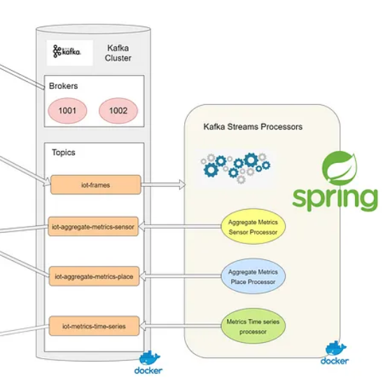

# Analyze and make aggregations.
- การวิเคราะห์และการจัดกลุ่มข้อมูลที่เก็บรวบรวมจากsensor ส่วนนี้ใช้ service apache kafka, kafka cluster  สำหรับวิเคราะห์และประมวลผลข้อมูลแบบ streaming realtime และใช้ service kafka Streams Processors ในการ process สามหัวข้อนี้ คือ, Aggregate Metrics By Sensor Processor, Aggregate Metrics By Place Processor, Aggregate Metrics time series

##  Aggregate Metrics By Sensor Processor
- ทำหน้าที่รวบรวมข้อมูลจากเซ็นเซอร์แต่ละตัว โดยใช้ Kafka Streams เพื่อวิเคราะห์และสรุปข้อมูลที่มาจาก topics

## Aggregate Metrics By Place Processor
- ประมวลผลข้อมูลที่รวบรวมจากเซ็นเซอร์ตามตำแหน่งหรือพื้นที่ เพื่อให้สามารถวิเคราะห์สถานะหรือสภาพแวดล้อมของพื้นที่เฉพาะเจาะจง

## Aggregate Metrics time series
- จัดการและวิเคราะห์ข้อมูลเป็นแบบ time-series ทำให้สามารถดูการเปลี่ยนแปลงของข้อมูลตลอดเวลาในรูปแบบเส้นกราฟของ time series

