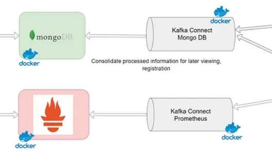

# Store data.
- เป็นส่วนที่เก็บข้อมูลหรือที่พักข้อมูลชั่วคราวและค่อยส่งไปยังserviceอื่นๆตามกระบวนการ ส่ววนี้ใช้ MongoDB เป็นฐานข้อมูลและใช้ Mongo Express เป็นตัวจัดการ MongoDB

 - ภายใน mongoDB จะมีข้อมูลที่ถูกประมวลจาก iot-sensor ต่างๆ ทั้ง tmp, humidity 
 - Prometheus ถูกใช้ในการจัดการและแสดงผลข้อมูลเกี่ยวกับ Metrics ของระบบ เช่น ประสิทธิภาพการทำงานของ Kafka, การใช้งานทรัพยากรของเซิร์ฟเวอร์, และข้อมูลการมอนิเตอร์เซ็นเซอร์แบบเรียลไทม์.